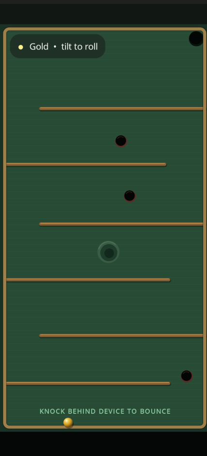

# RollingMaze

The rolling maze is a simple game where the player controls a ball that rolls through a maze. The goal is to reach the end of the maze while avoiding obstacles.
the Game rurns on the **MAUI** APP Main Screen. 
It is designed for phones, or tablets that support accelerometers not desktops.
It will run inside a SKiaSharp View that will fit the full window.
At the start of the game the user will be asked which type of ball they will use (wood, silver, gold ) each have different physics, slickness, weight, inertia... 

Work Balls with different physics work. 



## Maze files and designer

`RollingMaze.Mazes` contains the shared, versioned maze format. The first maze is still hardcoded; later mazes can be loaded from independent `.rollingmaze.json` files. See [the file-format specification](docs/maze-file-format.md) and the bundled `maze2.rollingmaze.json` example.

`MazeDesigner` is a separate Windows WPF application. Run it with:

```powershell
dotnet run --project MazeDesigner
```

Choose **Draw wall** and drag on the board, or select a placement tool and click. In **Select / move** mode, drag existing items and use **Delete selected** when needed. The saved files use the exact parser consumed by RollingMaze.
